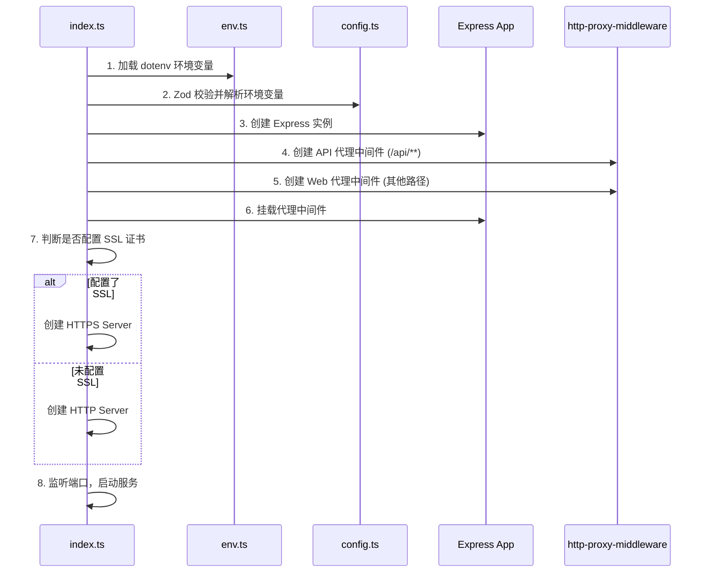
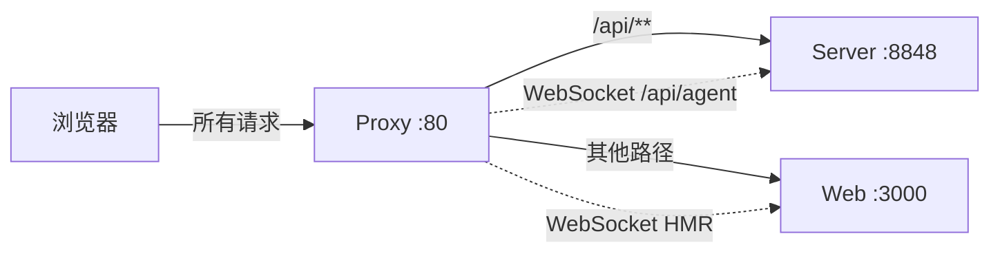

# Proxy 模块 - 反向代理服务

## 模块作用

Proxy 是 NapFlow 的网关层/反向代理服务，作为整个系统的统一入口，负责将用户请求路由到正确的后端服务。它解决了前后端分离架构中的跨域问题，并提供了统一的访问端口。

**核心职责：**
- 将 `/api/**` 路径的请求代理到 Server 后端服务（并去除 `/api` 前缀）
- 将其他所有请求代理到 Web 前端服务
- 支持 WebSocket 代理（用于 Agent 实时通信和 Next.js HMR）
- 可选的 HTTPS 支持（通过配置 SSL 证书）
- 统一的超时控制和错误处理

## 项目结构

```
apps/proxy/
├── src/
│   ├── index.ts          # 入口文件 - 启动 Express 服务并挂载代理
│   ├── config.ts         # 配置文件 - Zod 校验环境变量
│   ├── env.ts            # 环境变量加载 - dotenv 初始化
│   └── logger.ts         # 日志配置 - Pino 日志实例
├── .env                  # 环境变量模板（含注释说明）
├── .env.development      # 开发环境变量
├── .env.production       # 生产环境变量
├── Dockerfile            # Docker 构建文件
├── nest-cli.json         # NestJS CLI 配置（用于构建）
├── tsconfig.json         # TypeScript 配置
├── tsconfig.build.json   # 构建用 TypeScript 配置
└── package.json          # 模块依赖
```

## 跑起来的原理

### 启动流程



### 运行机制

1. **环境变量加载**：`env.ts` 使用 `dotenv` 按优先级加载环境变量文件（`.env.{NODE_ENV}.local` > `.env.{NODE_ENV}` > `.env`）
2. **配置校验**：`config.ts` 使用 Zod Schema 对环境变量进行严格校验，确保必填项存在且格式正确
3. **代理挂载**：按顺序挂载两个代理中间件：
   - **API 代理**（优先匹配）：匹配 `/api/**` 路径，转发到 Server 服务，同时去除 `/api` 前缀
   - **Web 代理**（兜底匹配）：所有其他请求转发到 Web 前端服务
4. **WebSocket 支持**：两个代理均启用 `ws: true`，支持 WebSocket 升级
5. **错误处理**：API 代理配置了 `on.error` 回调，当后端不可达时返回 502 错误

## 交互流程



### 请求路由示例

| 原始请求 | 代理目标 | 转发路径 |
|----------|----------|----------|
| `GET /api/account/info` | Server:8848 | `GET /account/info` |
| `GET /api/workflow/list` | Server:8848 | `GET /workflow/list` |
| `WS /api/agent` | Server:8848 | `WS /agent` |
| `GET /bots` | Web:3000 | `GET /bots` |
| `GET /_next/static/...` | Web:3000 | `GET /_next/static/...` |

## 环境变量

| 变量名 | 必填 | 说明 | 默认值 |
|--------|------|------|--------|
| `LISTEN_PORT` | 否 | 监听端口 | `80` |
| `LISTEN_HOST` | 否 | 监听主机 | `127.0.0.1` |
| `LOGGER_LEVEL` | 否 | 日志级别 | `info` |
| `PROXY_TIMEOUT_MS` | 否 | 代理超时时间（毫秒） | `15000` |
| `WEB_TARGET` | **是** | Web 前端服务地址 | - |
| `API_TARGET` | **是** | API 后端服务地址 | - |
| `SECURITY_KEY_PATH` | 否 | SSL 私钥路径（启用 HTTPS） | - |
| `SECURITY_CERT_PATH` | 否 | SSL 证书路径（启用 HTTPS） | - |

> ⚠️ `SECURITY_KEY_PATH` 和 `SECURITY_CERT_PATH` 必须同时提供或同时省略。

## 开发命令

```bash
# 开发模式（热重载）
pnpm start:dev

# 普通启动
pnpm start

# 构建
pnpm build

# 生产模式启动
pnpm start:prod
```

## 技术依赖

- **Express 5** - HTTP 服务框架
- **http-proxy-middleware** - 代理中间件
- **Pino** - 高性能日志库
- **Zod** - 运行时类型校验
- **dotenv** - 环境变量管理
