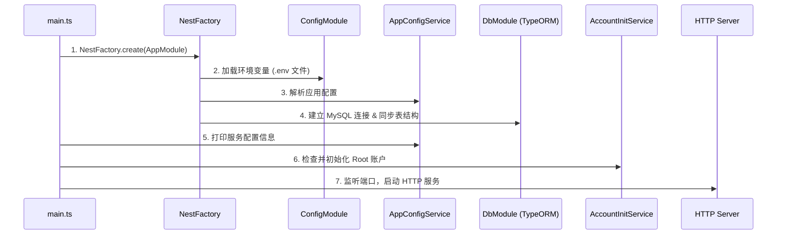
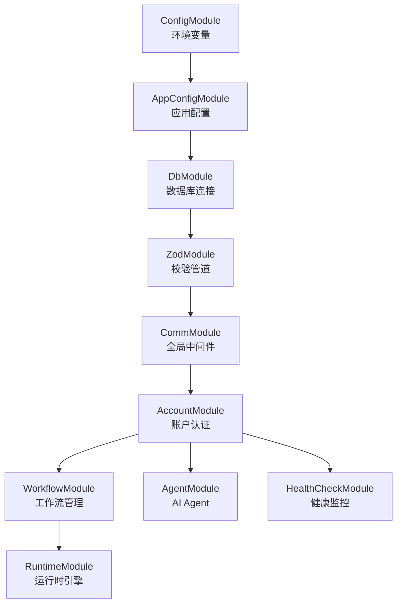
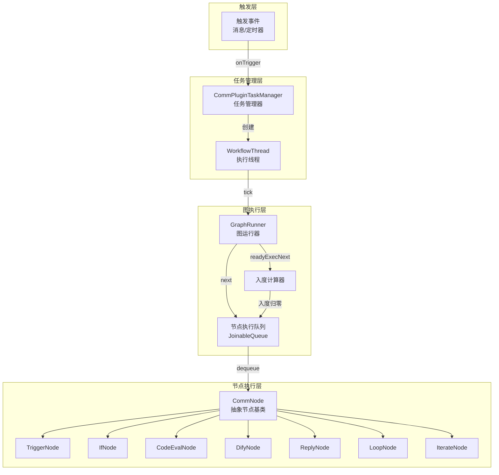
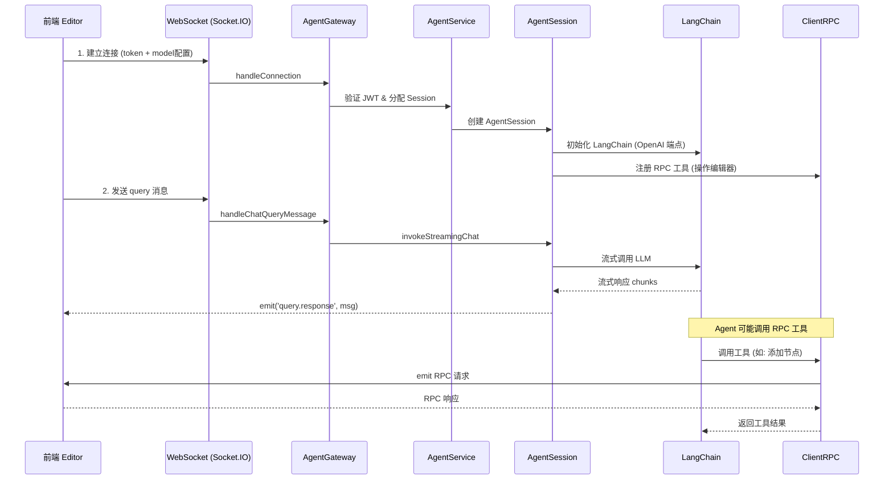
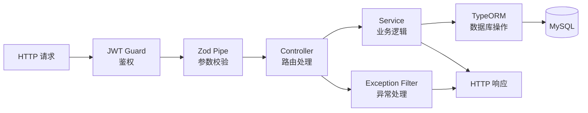
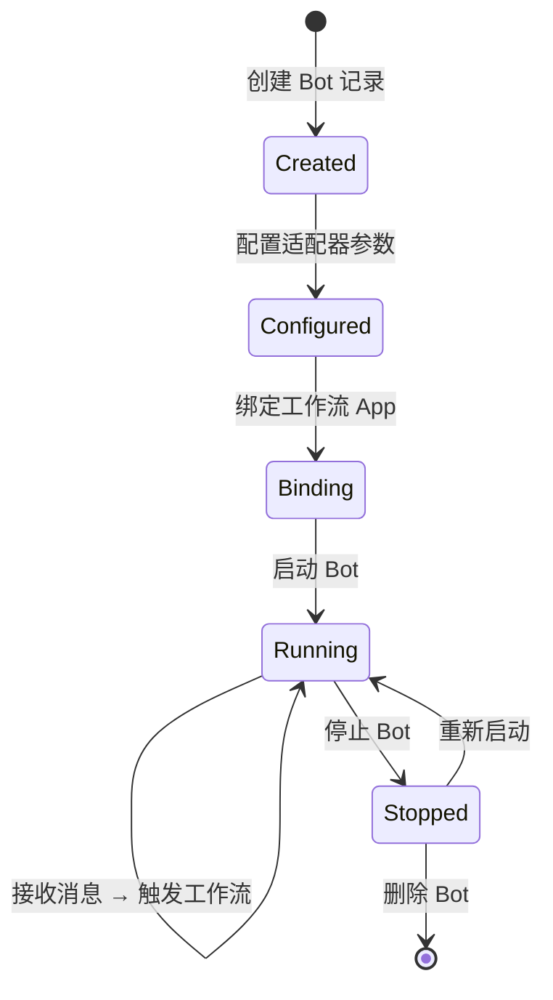

# Server 模块 - 后端服务

## 模块作用

Server 是 NapFlow 的核心后端服务，基于 NestJS 框架构建，负责所有业务逻辑处理、数据持久化、工作流运行时执行、AI Agent 会话管理以及 Bot 实例生命周期管理。

**核心职责：**
- 用户账户认证与管理（JWT）
- 工作流 CRUD 与版本管理
- 工作流运行时引擎（节点执行、图遍历、任务调度）
- QQ Bot 实例管理与适配器对接
- AI Agent WebSocket 网关（LangChain 集成）
- 系统健康监控（CPU、内存、GC、事件循环）
- 应用配置管理

## 项目结构

```
apps/server/
├── src/
│   ├── main.ts                    # 入口文件 - NestJS 应用启动
│   ├── app.module.ts              # 根模块 - 注册所有子模块
│   ├── config/
│   │   └── env.ts                 # 环境变量工具
│   ├── decorator/                 # 自定义装饰器
│   │   ├── account.ts             # 账户相关装饰器
│   │   ├── common.ts              # 通用装饰器
│   │   ├── jwt.ts                 # JWT 装饰器
│   │   └── zod.ts                 # Zod 校验装饰器
│   ├── utils/                     # 工具函数
│   │   ├── algorithm.ts           # 算法工具（拓扑排序等）
│   │   ├── task-pool.ts           # 任务池实现
│   │   ├── template.ts            # 模板引擎
│   │   ├── nest-middleware.ts     # NestJS 中间件工具
│   │   └── traits.ts              # 类型特征工具
│   └── apps/                      # 业务模块
│       ├── account/               # 账户模块
│       ├── agent/                 # AI Agent 模块
│       ├── app-config/            # 应用配置模块
│       ├── db/                    # 数据库模块
│       ├── health/                # 健康检查模块
│       ├── middleware/            # 全局中间件
│       ├── runtime/               # 运行时模块（核心）
│       ├── workflow/              # 工作流模块
│       └── zod/                   # Zod 校验模块
├── test/                          # E2E 测试
│   ├── account.e2e-spec.ts        # 账户接口测试
│   ├── agent.e2e-spec.ts          # Agent 接口测试
│   ├── workflow.e2e-spec.ts       # 工作流接口测试
│   ├── runtime.e2e-spec.ts        # 运行时测试
│   ├── runtime-binding.e2e-spec.ts # 运行时绑定测试
│   └── utils/                     # 测试工具
├── .env                           # 环境变量模板
├── Dockerfile                     # Docker 构建文件
├── nest-cli.json                  # NestJS CLI 配置
├── vitest.config.ts               # Vitest 测试配置
└── package.json                   # 模块依赖
```

### 业务模块详解

| 模块 | 路径 | 职责 |
|------|------|------|
| **Account** | `apps/account/` | 用户注册、登录、JWT 认证、权限管理 |
| **Agent** | `apps/agent/` | AI Agent WebSocket 网关、LangChain 集成、RPC 工具 |
| **AppConfig** | `apps/app-config/` | 全局应用配置服务（数据库连接、端口等） |
| **DB** | `apps/db/` | TypeORM 数据库连接、实体定义、Repository |
| **Health** | `apps/health/` | 系统健康指标采集（CPU/内存/GC/事件循环） |
| **Middleware** | `apps/middleware/` | 全局异常过滤器、通用中间件 |
| **Runtime** | `apps/runtime/` | 工作流运行时引擎、Bot 适配器、任务调度 |
| **Workflow** | `apps/workflow/` | 工作流 CRUD、版本管理、数据服务 |
| **Zod** | `apps/zod/` | Zod 校验管道、异常过滤器 |

## 跑起来的原理

### 启动流程



### 模块加载顺序



### 工作流运行时引擎

运行时引擎是 Server 最核心的部分，负责将用户设计的工作流图转化为可执行的任务流。



**核心概念：**

1. **CommPlugin（插件）**：每个工作流绑定对应一个 Plugin 实例，持有图结构和任务管理器
2. **WorkflowThread（线程）**：每次触发创建一个 Thread，拥有独立的 KV 上下文和执行状态
3. **GraphRunner（图运行器）**：基于拓扑排序的入度管理，确保节点按依赖顺序执行
4. **CommNode（节点）**：所有节点的抽象基类，通过 `onThread()` 方法执行具体逻辑
5. **Task（任务）**：异步任务调度单元，支持 abort 和链式提交

### AI Agent 交互流程



## 交互流程

### HTTP API 请求流程



### Bot 生命周期



## 环境变量

| 变量名 | 必填 | 说明 | 默认值 |
|--------|------|------|--------|
| `HOST_NAME` | 否 | 服务监听主机 | `localhost` |
| `PORT` | 否 | 服务监听端口 | `8848` |
| `MYSQL_USERNAME` | **是** | MySQL 用户名 | - |
| `MYSQL_PWD` | **是** | MySQL 密码 | - |
| `MYSQL_HOSTPORT` | 否 | MySQL 地址 | `localhost:3306` |
| `MYSQL_DATABASE` | 否 | 数据库名 | `napflow_db` |
| `ACC_ROOT_EMAIL` | 否 | Root 账户邮箱 | - |
| `ACC_ROOT_NICKNAME` | 否 | Root 账户昵称 | - |
| `ACC_ROOT_PASSWORD` | 否 | Root 账户密码 | - |
| `SYNC_ROOT_ACCOUNT_FLAG` | 否 | 启用 Root 账户同步 | 未设置 |
| `JWT_SECRET_KEY` | 否 | JWT 签名密钥 | 随机生成 |

## 开发命令

```bash
# 开发模式（热重载）
pnpm start:dev

# 调试模式
pnpm start:debug

# 构建
pnpm build

# 生产模式启动
pnpm start:prod

# 运行所有测试
pnpm test

# 仅运行单元测试
pnpm test:unit

# 监听模式测试
pnpm test:watch

# 测试覆盖率
pnpm test:cov
```

## 数据库实体

| 实体 | 文件 | 说明 |
|------|------|------|
| Account | `db/models/account.entity.ts` | 用户账户 |
| Workflow | `db/models/workflow.entity.ts` | 工作流定义 |
| Bot | `db/models/bot.entity.ts` | Bot 实例 |
| Agent (OpenAI Endpoint) | `db/models/agent.entity.ts` | AI 模型端点配置 |

## 技术依赖

- **NestJS 11** - 后端框架（IoC、模块化、装饰器）
- **TypeORM** - 数据库 ORM
- **MySQL 8.4** - 关系型数据库
- **Socket.IO** - WebSocket 实时通信
- **LangChain / LangGraph** - AI Agent 框架
- **Piscina** - Worker 线程池（代码执行沙箱）
- **VM2** - JavaScript 沙箱执行
- **bcrypt** - 密码加密
- **jsonwebtoken** - JWT 签发与验证
- **Zod** - 运行时类型校验
- **NapCat SDK** - QQ 机器人协议适配
