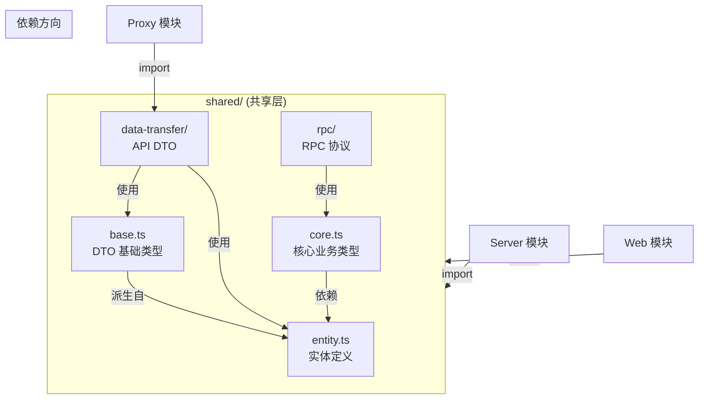
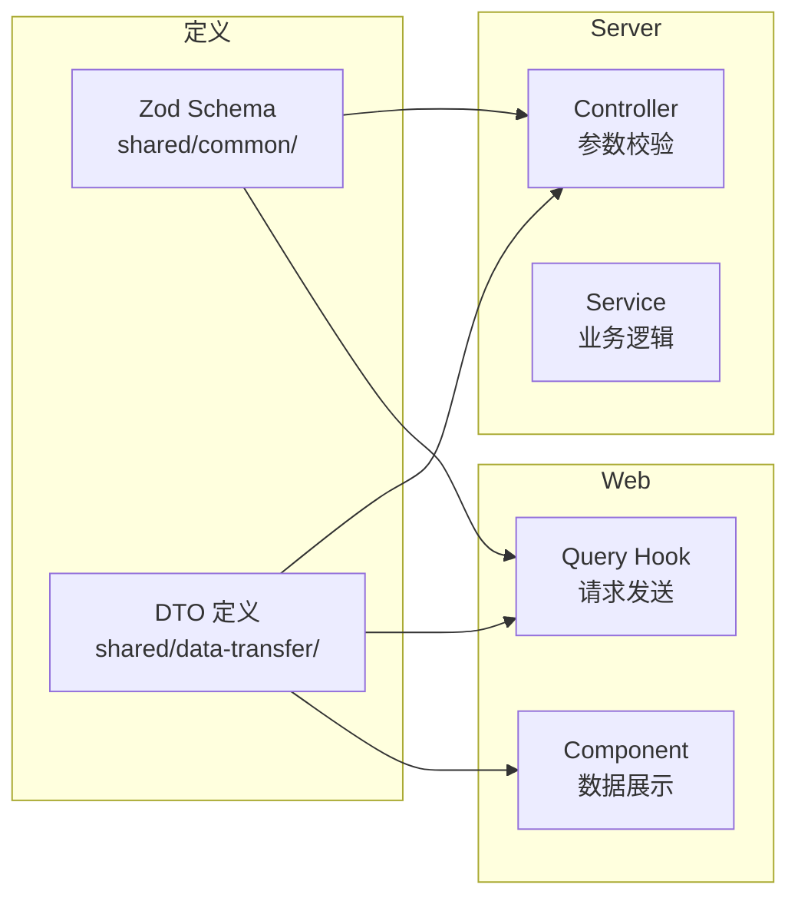
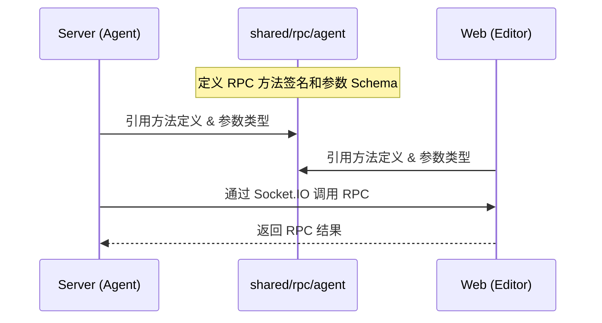

# Shared 模块 - 共享代码库

## 模块作用

Shared 是 NapFlow 的共享代码模块，作为 monorepo 中各服务（Server、Web、Proxy）之间的公共依赖层。它定义了跨模块共享的类型、实体、DTO（数据传输对象）、RPC 协议和工具函数，确保前后端之间的类型安全和数据一致性。

**核心职责：**
- 定义前后端共享的实体类型和业务常量
- 定义 API 请求/响应的 DTO（基于 Zod Schema）
- 定义 WebSocket RPC 协议和事件类型
- 提供通用工具函数和数据结构
- 作为"契约层"保证前后端接口的类型一致性

## 项目结构

```
apps/shared/
├── common/                        # 通用业务类型定义
│   ├── account/                   # 账户相关类型
│   │   ├── base.ts                # 账户 DTO 基础类型
│   │   ├── core.ts                # 核心导出
│   │   └── entity.ts              # 账户实体类型
│   ├── agent/                     # Agent 相关类型
│   │   ├── entity.ts              # Agent 实体（OpenAI 端点配置）
│   │   └── socketio/              # Socket.IO 事件/认证类型
│   │       ├── auth.ts            # WebSocket 连接认证 Schema
│   │       └── events.ts          # WebSocket 事件类型
│   ├── bot/                       # Bot 相关类型
│   │   ├── base.ts                # Bot 基础 DTO
│   │   ├── entity.ts              # Bot 实体类型
│   │   ├── core/                  # Bot 核心类型
│   │   │   ├── adapter.ts         # 适配器类型
│   │   │   ├── config.ts          # Bot 配置类型
│   │   │   └── status.ts          # Bot 状态枚举
│   │   ├── health-check.ts        # Bot 健康检查类型
│   │   └── napcatws-adapter.ts    # NapCat WS 适配器配置
│   ├── health-check/              # 系统健康检查类型
│   │   ├── base.ts                # 基础采样类型
│   │   ├── cpu.ts                 # CPU 指标类型
│   │   ├── event-loop.ts          # 事件循环指标类型
│   │   ├── gc.ts                  # GC 指标类型
│   │   ├── health-check.ts        # 综合健康检查类型
│   │   └── mem.ts                 # 内存指标类型
│   └── workflow/                  # 工作流相关类型
│       ├── base.ts                # 工作流基础 DTO
│       ├── core.ts                # 核心类型导出
│       ├── entity.ts              # 工作流实体类型
│       ├── core/                  # 核心类型定义
│       │   ├── component-node.ts  # 组件节点类型
│       │   ├── re-export.ts       # 重导出
│       │   └── workflow-node-data.ts # 节点数据类型
│       └── node-data/             # 各节点数据 Schema
│           ├── trigger.ts         # 触发器节点
│           ├── reply.ts           # 回复节点
│           ├── if.ts              # 条件节点
│           ├── code-eval.ts       # 代码执行节点
│           ├── dify.ts            # Dify 节点
│           ├── json-read.ts       # JSON 读取节点
│           ├── array-index-read.ts # 数组索引节点
│           ├── loop.ts            # 循环节点
│           ├── loop-start.ts      # 循环起始节点
│           ├── iterate.ts         # 迭代节点
│           ├── iterate-start.ts   # 迭代起始节点
│           └── timer.ts           # 定时器节点
├── data-struct/                   # 自定义数据结构
│   └── JoinableQueue.ts           # 可合并队列（用于图遍历）
├── data-transfer/                 # 数据传输对象 (DTO)
│   ├── _base.ts                   # 基础响应类型 (Resp, Code)
│   ├── account/
│   │   └── account.ts             # 账户相关 API DTO
│   ├── agent/
│   │   ├── endpoint.ts            # Agent 端点 DTO
│   │   └── session.ts             # Agent 会话 DTO
│   ├── bot/
│   │   ├── bridge.ts              # Bot 绑定 DTO
│   │   ├── health-check.ts        # Bot 健康检查 DTO
│   │   └── manager.ts             # Bot 管理 DTO
│   ├── health-check/
│   │   └── samples.ts             # 健康采样 DTO
│   └── workflow/
│       └── info.ts                # 工作流信息 DTO
├── rpc/                           # RPC 协议定义
│   ├── core/
│   │   └── ts-check.ts            # RPC 类型检查工具
│   └── agent/
│       └── client-rpc/            # Agent → 前端 RPC
│           ├── methods.ts         # RPC 方法定义
│           ├── schema.ts          # RPC 参数 Schema
│           └── tools.ts           # RPC 工具注册
├── utils/                         # 工具函数
│   ├── ts-utils.ts                # TypeScript 类型工具
│   └── zod-transfer.ts            # Zod Schema 转换工具
├── package.json
├── tsconfig.json
└── eslint.config.mjs
```

## 跑起来的原理

Shared 模块本身不是一个可运行的服务，而是作为 pnpm workspace 中的内部包被其他模块引用。

### 引用方式

在 Server 和 Web 模块中，通过 TypeScript 路径别名直接引用：

```typescript
// Server 中引用
import { Resp, Code } from '@shared/data-transfer/_base'
import { ZodCheckWsAgentConnectionRequest } from '@shared/common/agent/socketio/auth'

// Web 中引用
import type { WorkflowNodeData } from '@shared/common/workflow/core/workflow-node-data'
```

### 设计原则



**层级依赖规则：**
1. `entity` → 最底层，定义数据库实体对应的纯类型
2. `core` → 依赖 entity，定义业务核心逻辑类型
3. `base` → 依赖 entity，定义各种 DTO 派生类型
4. `data-transfer` → 使用 base 和 entity，定义 API 请求/响应格式
5. `rpc` → 使用 core，定义 WebSocket RPC 方法签名

## 交互流程

### 类型共享流程



### RPC 协议流程（Agent → 前端编辑器）



## 代码规范

- 定义 POJO 类型时使用 `nullable` 而不是 `optional`（确保字段始终存在）
- RPC 参数使用 `tuple` 形式以适应 Socket.IO 的事件参数传递
- 所有 API DTO 使用 Zod Schema 定义，同时导出类型和校验器
- `data-transfer/_base.ts` 中定义了统一的响应格式 `Resp` 和状态码 `Code`

## 各子模块说明

| 子模块 | 说明 |
|--------|------|
| `common/` | 业务实体和核心类型定义，是最基础的类型层 |
| `data-struct/` | 自定义数据结构（如 JoinableQueue 用于工作流图遍历） |
| `data-transfer/` | API 请求/响应的 DTO 定义，包含 Zod 校验 Schema |
| `rpc/` | WebSocket RPC 协议定义（方法签名、参数类型） |
| `utils/` | 通用工具函数（TypeScript 类型工具、Zod 转换等） |

## 开发命令

```bash
# 代码格式化
pnpm lint:prettier

# ESLint 修复
pnpm lint

# 全部检查
pnpm lint:all
```

## 技术依赖

- **Zod** - 运行时类型校验和 Schema 定义
- **TypeScript** - 静态类型系统
- 无运行时依赖，纯类型/Schema 定义模块
