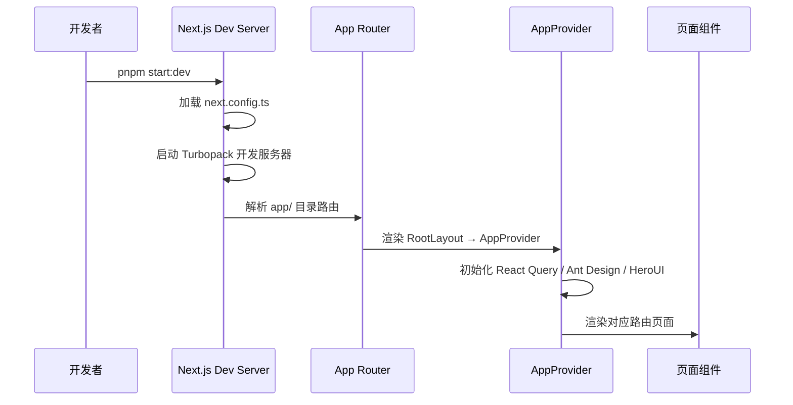
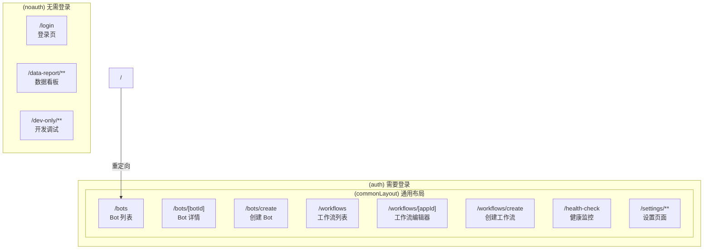
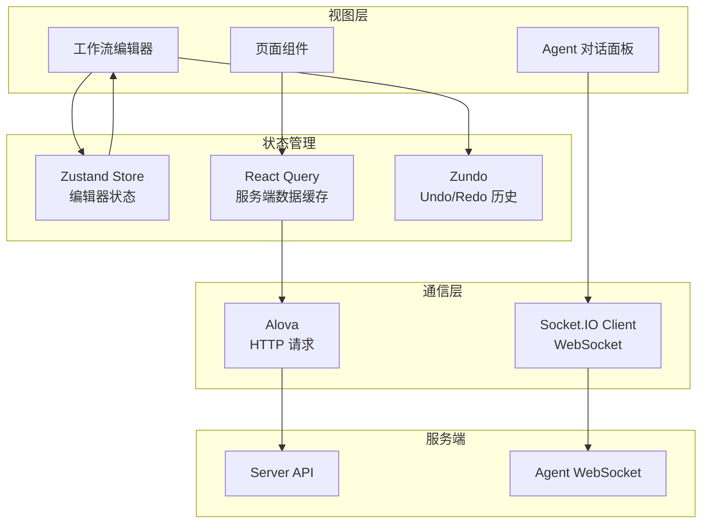
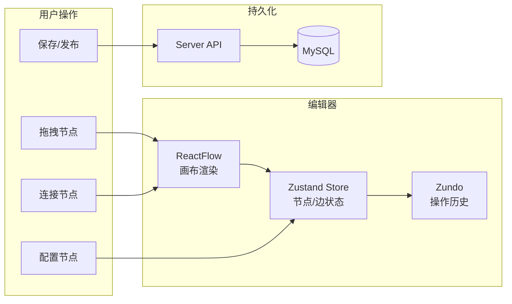
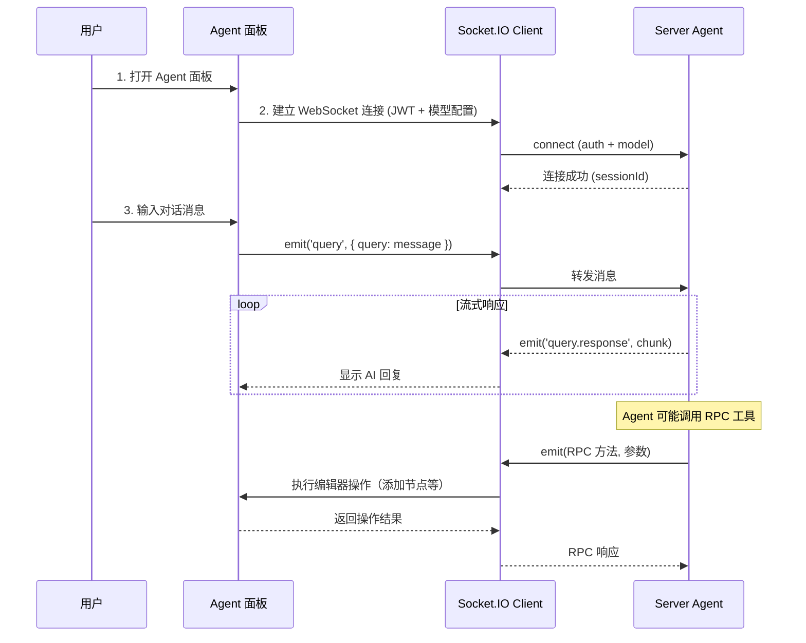
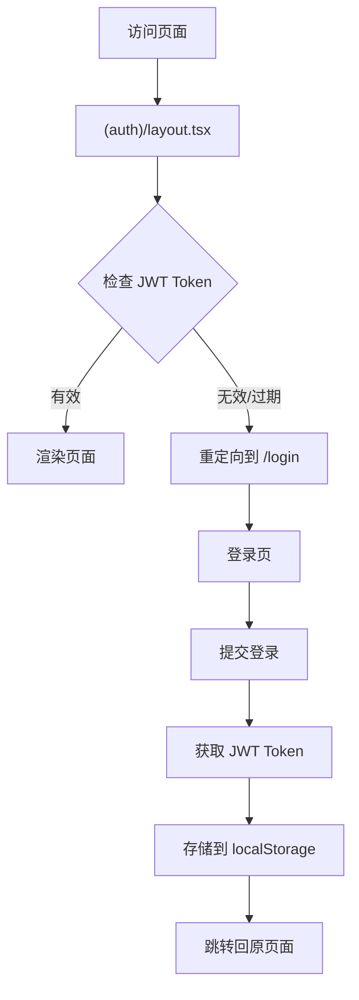

# Web 模块 - 前端应用

## 模块作用

Web 是 NapFlow 的前端应用，基于 Next.js 16 + React 19 构建，提供完整的用户交互界面。包括可视化工作流编辑器、Bot 管理面板、AI Agent 对话界面、系统监控看板以及用户设置等功能。

**核心职责：**
- 可视化工作流编辑器（基于 ReactFlow）
- QQ Bot 管理界面（创建、配置、绑定工作流、健康监控）
- AI Agent 对话界面（WebSocket 实时通信）
- 系统健康监控看板（CPU、内存、GC、事件循环图表）
- 用户账户管理（登录、注册、设置）
- 数据上报看板

## 项目结构

```
apps/web/
├── app/                           # Next.js App Router 页面
│   ├── layout.tsx                 # 根布局
│   ├── globals.css                # 全局样式
│   ├── error.tsx                  # 错误边界
│   ├── global-error.tsx           # 全局错误处理
│   ├── (auth)/                    # 需要登录的页面
│   │   ├── layout.tsx             # 认证布局（JWT 校验）
│   │   └── (commonLayout)/        # 通用布局（顶部导航）
│   │       ├── layout.tsx         # 通用页面布局
│   │       ├── bots/              # Bot 管理页面
│   │       ├── workflows/         # 工作流管理页面
│   │       ├── health-check/      # 健康监控页面
│   │       └── settings/          # 设置页面
│   ├── (noauth)/                  # 无需登录的页面
│   │   ├── (account)/login/       # 登录页
│   │   ├── data-report/           # 数据上报看板
│   │   └── dev-only/              # 开发调试页面
│   ├── components/                # 页面组件
│   │   ├── _base/                 # 基础 UI 组件
│   │   ├── account/               # 账户组件
│   │   ├── app/                   # 应用级组件（Provider）
│   │   ├── bot/                   # Bot 相关组件
│   │   ├── common-layout/         # 通用布局组件
│   │   ├── data-report/           # 数据看板组件
│   │   ├── health-check/          # 健康监控组件
│   │   ├── setting/               # 设置组件
│   │   └── workflow/              # 工作流组件（核心）
│   │       ├── editor/            # 工作流编辑器
│   │       │   ├── index.tsx      # 编辑器入口
│   │       │   ├── EditorMainView.tsx  # 主视图
│   │       │   ├── component-nodes/    # 节点组件
│   │       │   ├── hooks/         # 编辑器 Hooks
│   │       │   ├── mainview/      # 主视图子组件
│   │       │   │   └── workflow-agent/ # Agent 对话面板
│   │       │   ├── providers/     # Context Providers
│   │       │   ├── store/         # Zustand Store
│   │       │   ├── note/          # 注释组件
│   │       │   └── utils/         # 编辑器工具
│   │       ├── app-list/          # 工作流列表
│   │       ├── app-publish/       # 工作流发布
│   │       ├── app-settings/      # 工作流设置
│   │       ├── create-app/        # 创建工作流
│   │       ├── hooks/             # 工作流 Hooks
│   │       └── side-menus/        # 侧边菜单
│   ├── hooks/                     # 全局 Hooks
│   │   ├── account/               # 账户相关 Hooks
│   │   ├── antd-charts/           # 图表 Hooks
│   │   ├── query/                 # 数据请求 Hooks (React Query)
│   │   └── utils/                 # 工具 Hooks
│   └── style/                     # 样式配置
├── config/
│   └── env.ts                     # 环境变量配置
├── utils/                         # 工具函数
│   ├── babel.ts                   # Babel AST 工具
│   ├── comm.ts                    # 通用工具
│   ├── data-report/               # 数据上报工具
│   ├── date.ts                    # 日期工具
│   ├── dom.ts                     # DOM 工具
│   ├── form.ts                    # 表单工具
│   ├── net.ts                     # 网络请求工具
│   ├── next.ts                    # Next.js 工具
│   ├── next-client.ts             # 客户端 Next.js 工具
│   ├── react.ts                   # React 工具
│   ├── react-wrap.tsx             # React 包装组件
│   ├── tools.ts                   # 通用工具
│   └── type.ts                    # 类型工具
├── public/                        # 静态资源
├── e2e/                           # E2E 测试 (Playwright)
│   ├── bots.spec.ts               # Bot 页面测试
│   ├── login.spec.ts              # 登录测试
│   ├── settings.spec.ts           # 设置页面测试
│   ├── health-check.spec.ts       # 健康检查测试
│   └── utils/                     # 测试工具
├── test/                          # 单元测试
│   ├── utils/                     # 工具函数测试
│   └── workflow/                  # 工作流逻辑测试
├── .rules/                        # 代码规范文档
│   ├── code-style.md              # 代码风格规范
│   ├── css-style.md               # CSS 样式规范
│   └── reacthooks.md             # React Hooks 规范
├── .env                           # 环境变量模板
├── Dockerfile                     # Docker 构建文件
├── next.config.ts                 # Next.js 配置
├── playwright.config.ts           # Playwright 配置
├── vitest.config.ts               # Vitest 配置
├── postcss.config.mjs             # PostCSS 配置
└── package.json                   # 模块依赖
```

## 跑起来的原理

### 启动流程



### 路由结构



### 数据流架构



## 交互流程

### 工作流编辑器交互



### Agent 对话交互



### 页面认证流程



## 环境变量

| 变量名 | 必填 | 说明 | 默认值 |
|--------|------|------|--------|
| `NEXT_PUBLIC_API_URL` | 否 | 前端 API 基础路径 | `/api` |
| `NEXT_PUBLIC_NODE_ENV` | 否 | 前端运行环境标识 | `$NODE_ENV` |
| `STRENGTH_PASSWORD_LENGTH` | 否 | 密码强度最小长度 | `8` |

## 开发命令

```bash
# 开发模式（Turbopack 热重载）
pnpm dev
# 或
pnpm start:dev

# 构建
pnpm build

# 生产模式启动
pnpm start:prod

# 单元测试
pnpm test:unit

# E2E 测试
pnpm test:e2e

# E2E 测试（带 UI）
pnpm test:e2e:ui

# E2E 测试（有头模式）
pnpm test:e2e:headed

# 查看 E2E 测试报告
pnpm test:e2e:report

# 代码格式化
pnpm lint:prettier

# ESLint 修复
pnpm lint
```

## 核心技术实现

### 工作流编辑器

- **画布渲染**：基于 `@xyflow/react` (ReactFlow 12)，支持节点拖拽、缩放、连线
- **状态管理**：使用 Zustand 管理节点/边/选中状态，配合 Zundo 实现 Undo/Redo
- **节点组件**：每种工作流节点对应一个 React 组件，通过 `component-nodes/` 目录组织
- **自动布局**：集成 `@dagrejs/dagre` 实现节点自动排列
- **子图支持**：循环/迭代节点内部支持嵌套子图

### AI Agent 集成

- **WebSocket 通信**：使用 `socket.io-client` 与 Server 的 Agent Gateway 通信
- **流式渲染**：实时显示 AI 回复的流式 chunks
- **RPC 接收**：前端注册 RPC 方法，Agent 可远程调用编辑器操作
- **会话恢复**：断线重连后自动恢复对话历史

### 数据请求

- **React Query**：使用 `@tanstack/react-query` 管理服务端状态缓存
- **Alova**：HTTP 请求库，统一请求/响应拦截
- **类型安全**：请求/响应类型从 `shared/data-transfer` 导入，前后端类型一致

## 技术依赖

| 类别 | 技术 |
|------|------|
| 框架 | Next.js 16 + React 19 |
| UI 库 | Ant Design 6 + HeroUI (beta) |
| 样式 | TailwindCSS 4 + PostCSS |
| 状态管理 | Zustand + Zundo (Undo/Redo) |
| 数据请求 | React Query + Alova |
| 工作流编辑器 | @xyflow/react + @dagrejs/dagre |
| 富文本编辑器 | Lexical |
| 代码编辑器 | Monaco Editor |
| 实时通信 | Socket.IO Client |
| 图表 | @ant-design/charts |
| 工具库 | ahooks + immer + dayjs + lodash-es |
| 测试 | Vitest + Playwright + Testing Library |
| 代码规范 | ESLint + Prettier |
